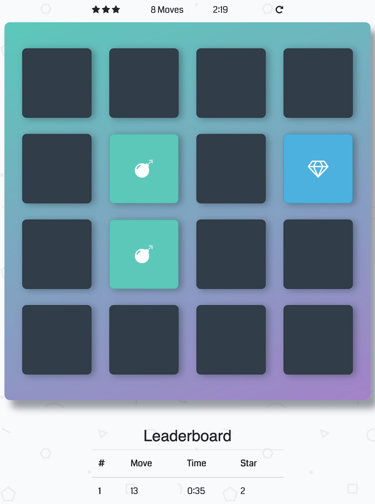

# Memory Game

The game board consists of sixteen "cards" arranged in a grid. The deck is made up of eight different pairs of cards, each with different symbols on one side. The cards are arranged randomly on the grid with the symbol face down. The gameplay rules are very simple: flip over two hidden cards at a time to locate the ones that match!

## How To Play

* The player flips one card over to reveal its underlying symbol.
* The player then turns over a second card, trying to find the corresponding card with the same symbol.
* If the cards match, both cards stay flipped over.
* If the cards do not match, both cards are flipped face down.
* The game ends once all cards have been correctly matched.

## Leaderboard
The leaderboard displays number of moves, time taken and star rating of top 5 scores sorted by number of moves. Try matching all the cards before 10 moves to get 3 stars! :)

## Technology Used
The game is developed using HTML, CSS, JavaScript. `Font-awesome` is used for the beautiful icons. The game uses `bootstrap` and its responsive design is fit for all modern desktop, tablet, and phone browsers.

Have Fun!

